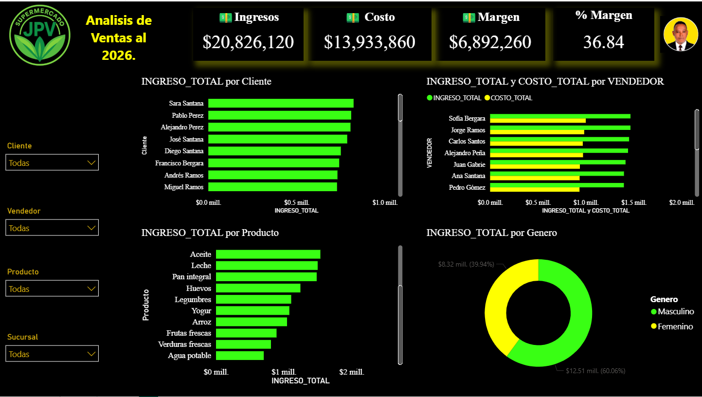

# 🎨 Creación de Temas Personalizados para Power BI con JSON y IA

<div align="center">


**🚀 Transforma tus dashboards de Power BI con temas personalizados creados mediante IA**

[✨ Demo](#-demo) • [📖 Documentación](#-tabla-de-contenidos) • [🎯 Casos de Uso](#-casos-de-uso) • [⭐ Contribuir](#-contribuir)

</div>





---

## 📑 Tabla de Contenidos

- [🎯 ¿Qué es un Tema JSON en Power BI?](#-qué-es-un-tema-json-en-power-bi)
- [💡 El Problema y la Solución](#-el-problema-y-la-solución)
- [🏗️ Anatomía de un Tema JSON](#️-anatomía-de-un-tema-json)
- [🤖 Usando IA para Crear Temas](#-usando-ia-para-crear-temas)
- [📝 El Prompt Perfecto](#-el-prompt-perfecto)
- [🎨 Elementos Personalizables](#-elementos-personalizables)
- [🔧 Guía de Implementación](#-guía-de-implementación)
- [💼 Caso de Estudio: Supermercado JJPV](#-caso-de-estudio-supermercado-jjpv)
- [⚡ Ventajas de Usar JSON + IA](#-ventajas-de-usar-json--ia)
- [🎓 Tips y Mejores Prácticas](#-tips-y-mejores-prácticas)
- [🌟 Galerías de Temas](#-galerías-de-temas)
- [📦 Instalación y Uso](#-instalación-y-uso)
- [🤝 Contribuir](#-contribuir)
- [📄 Licencia](#-licencia)
- [🔗 Redes Sociales](#-redes-sociales)

---

## 🎯 ¿Qué es un Tema JSON en Power BI?

Un **tema JSON** es un archivo de configuración que define la apariencia visual completa de tu reporte de Power BI. Funciona como una hoja de estilos CSS pero específicamente diseñada para Power BI.

### **¿Por qué usar temas JSON?**

✅ **Consistencia visual** en todos tus reportes  
✅ **Ahorro de tiempo** masivo (minutos vs horas)  
✅ **Fácil replicación** entre proyectos  
✅ **Branding corporativo** automatizado  
✅ **Mantenimiento centralizado** de estilos  

---

## 💡 El Problema y la Solución

### ❌ **El Problema Tradicional**

Configurar manualmente cada visual en Power BI es:

- ⏰ **Extremadamente lento** (30+ minutos por dashboard)
- 🔄 **Repetitivo y tedioso**
- 🎨 **Inconsistente** entre visuales
- 😫 **Difícil de mantener**
- 🚫 **No escalable** para múltiples reportes

### ✅ **La Solución: JSON + IA**

```
Configuración Manual (30+ min) → JSON + IA (2 minutos) = 🚀 15x más rápido
```

**Beneficios Inmediatos:**

1. 🎯 **Precisión total** en colores y estilos
2. 🔄 **Reutilización** instantánea
3. 🤖 **Generación asistida** por IA
4. 📊 **Consistencia** garantizada
5. ⚡ **Aplicación** en un click

---

## 🏗️ Anatomía de un Tema JSON

Un tema de Power BI tiene **3 secciones principales**:

### **1️⃣ Configuración Global**

```json
{
  "name": "Nombre del Tema",
  "dataColors": ["#39FF14", "#FFFF00", "#FFFFFF"],
  "background": "#000000",
  "foreground": "#FFFFFF",
  "tableAccent": "#FFFF00"
}
```

**Elementos globales:**
- `name`: Nombre identificativo del tema
- `dataColors`: Paleta de colores para series de datos (gráficos)
- `background`: Color de fondo general
- `foreground`: Color de texto principal
- `tableAccent`: Color de acento para tablas

---

### **2️⃣ Estilos Universales (`*`)**

Aplican a **TODOS** los visuales:

```json
"visualStyles": {
  "*": {
    "*": {
      "background": [{ "color": { "solid": { "color": "#000000" }}}],
      "title": [{ "fontColor": { "solid": { "color": "#FFFFFF" }}, "fontSize": 14 }],
      "legend": [{ "labelColor": { "solid": { "color": "#FFFFFF" }}}]
    }
  }
}
```

---

### **3️⃣ Estilos Específicos por Visual**

Configuración única para cada tipo de gráfico:

```json
"card": {
  "*": {
    "labels": [{ "fontSize": 25, "fontFamily": "DIN" }],
    "categoryLabels": [{ "color": { "solid": { "color": "#FFFF00" }}}],
    "visualBorder": [{ "show": true, "color": { "solid": { "color": "#FFFF00" }}}]
  }
}
```

---

## 🤖 Usando IA para Crear Temas

### **🎯 Flujo de Trabajo Completo**

```
📋 Definir Estilo → 🤖 Generar con IA → 📝 Revisar JSON → 💾 Guardar .json → ⬆️ Importar en Power BI → ✨ Aplicar Tema
```

---

## 📝 El Prompt Perfecto

### **🔥 Prompt Maestro para Claude/ChatGPT**

```markdown
Necesito crear un tema JSON personalizado para Power BI con las siguientes especificaciones:

**CONTEXTO DEL PROYECTO:**
- Nombre del negocio: Supermercado JJPV
- Industria: Retail/Supermercados
- Estilo deseado: Cyberpunk, futurista, neón

**PALETA DE COLORES:**
- Color principal: #39FF14 - Verde neón
- Color secundario: #FFFF00 - Amarillo brillante
- Color de fondo: #000000 - Negro
- Color de texto: #FFFFFF - Blanco
- Colores adicionales: #00FF00, #ADFF2F, #2ECC71, #CCFF00, #00FF7F

**VISUALES A CONFIGURAR:**
1. ✅ Cards (tarjetas de KPI)
   - Tamaño de fuente de valor: 25px
   - Tamaño de etiqueta: 12px
   - Borde con radio: 10px
   - Sombra: Amarilla, exterior, desenfoque 15px

2. ✅ Gráficos de Barras
   - Color de barras: Paleta dataColors
   - Etiquetas de datos: Amarillo (#FFFF00)
   - Ejes: Blanco, sin líneas de cuadrícula

3. ✅ Tablas
   - Encabezados: Blanco sobre negro
   - Valores: Blanco sobre negro
   - Totales: Amarillo sobre gris oscuro (#111111)
   - Bordes: Blancos visibles

4. ✅ Slicers (Segmentadores)
   - Encabezado: Dorado (#D4AC0D)
   - Items: Dorado sobre negro
   - Borde: Amarillo con radio 10px

5. ✅ Gráfico de Donut/Pie
   - Leyenda: Blanco
   - Etiquetas de datos: Colores de la paleta

6. ✅ KPIs
   - Indicador: Blanco
   - Caption: Amarillo

**TIPOGRAFÍAS:**
- Títulos: Segoe UI Bold, 14px
- Valores grandes: DIN, 25px
- Texto general: Segoe UI, 11-12px

**EFECTOS VISUALES:**
- Bordes redondeados (radius: 10px) en cards y slicers
- Drop shadow amarillo en cards (blur: 15px, transparencia: 50%)
- Sin bordes en gráficos generales
- Sin sombras en gráficos de barras/líneas

**ESTRUCTURA JSON REQUERIDA:**
{
  "name": "...",
  "dataColors": [...],
  "background": "...",
  "foreground": "...",
  "tableAccent": "...",
  "visualStyles": {
    "*": { ... },
    "card": { ... },
    "multiRowCard": { ... },
    "slicer": { ... },
    "tableEx": { ... },
    "kpi": { ... }
  }
}

**REQUISITOS ADICIONALES:**
- Incluir configuración para TODOS los elementos de cada visual
- Asegurar contraste suficiente para legibilidad
- Mantener consistencia en toda la paleta
- Optimizar para visualización en pantallas oscuras

Por favor, genera el JSON completo y funcional listo para importar en Power BI.
```

---

# 📂 Código Fuente del Tema (JSON)

Aquí encontrarás el script completo generado para este tema **Cyberpunk Neon**. Puedes copiarlo directamente o descargar el archivo adjunto en este repositorio.

### 📋 Instrucciones de uso:
1. Copia el código de abajo.
2. Guárdalo en tu computadora con el nombre: `Tema_Cyberpunk_V7.json`
3. Impórtalo en Power BI (Ver -> Temas -> Buscar temas).

```json
{
  "name": "Cyberpunk Juancito V7 Cards Only",
  "dataColors": [
    "#39FF14",
    "#FFFF00",
    "#FFFFFF",
    "#00FF00",
    "#ADFF2F",
    "#2ECC71",
    "#CCFF00",
    "#00FF7F"
  ],
  "background": "#000000",
  "foreground": "#FFFFFF",
  "tableAccent": "#FFFF00",
  "visualStyles": {
    "*": {
      "*": {
        "background": [
          {
            "show": true,
            "color": { "solid": { "color": "#000000" } },
            "transparency": 0
          }
        ],
        "visualBorder": [
          {
            "show": false
          }
        ],
        "dropShadow": [
          {
            "show": false
          }
        ],
        "title": [
          {
            "show": true,
            "fontColor": { "solid": { "color": "#FFFFFF" } },
            "fontSize": 14,
            "alignment": "left",
            "fontFamily": "Segoe UI Bold"
          }
        ],
        "subtitle": [
          {
            "show": true,
            "fontColor": { "solid": { "color": "#FFFFFF" } },
            "fontSize": 12
          }
        ],
        "legend": [
          {
            "show": true,
            "labelColor": { "solid": { "color": "#FFFFFF" } },
            "titleColor": { "solid": { "color": "#FFFFFF" } },
            "fontSize": 11,
            "fontFamily": "Segoe UI"
          }
        ],
        "categoryAxis": [
          {
            "show": true,
            "labelColor": { "solid": { "color": "#FFFFFF" } },
            "titleColor": { "solid": { "color": "#FFFFFF" } },
            "fontSize": 11,
            "fontFamily": "Segoe UI Bold"
          }
        ],
        "valueAxis": [
          {
            "show": true,
            "labelColor": { "solid": { "color": "#FFFFFF" } },
            "titleColor": { "solid": { "color": "#FFFFFF" } },
            "gridlineShow": false,
            "fontSize": 11,
            "fontFamily": "Segoe UI Bold"
          }
        ],
        "dataLabels": [
          {
            "show": true,
            "color": { "solid": { "color": "#FFFF00" } },
            "fontSize": 11,
            "fontFamily": "Segoe UI Bold"
          }
        ],
        "outspacePane": [
          {
            "backgroundColor": { "solid": { "color": "#000000" } },
            "foreground": { "solid": { "color": "#FFFFFF" } }
          }
        ]
      }
    },
    "card": {
      "*": {
        "labels": [
          {
            "color": { "solid": { "color": "#FFFFFF" } },
            "fontSize": 25,
            "fontFamily": "DIN"
          }
        ],
        "categoryLabels": [
          {
            "color": { "solid": { "color": "#FFFF00" } },
            "show": true,
            "fontSize": 12,
            "fontFamily": "Segoe UI Bold"
          }
        ],
        "visualBorder": [
          {
            "show": true,
            "color": { "solid": { "color": "#FFFF00" } },
            "radius": 10
          }
        ],
        "dropShadow": [
          {
            "show": true,
            "color": { "solid": { "color": "#FFFF00" } },
            "position": "Outer",
            "preset": "BottomRight",
            "transparency": 50,
            "blur": 15
          }
        ]
      }
    },
    "multiRowCard": {
      "*": {
        "dataLabels": [
          { "color": { "solid": { "color": "#FFFFFF" } }, "fontSize": 12 }
        ],
        "categoryLabels": [
          { "color": { "solid": { "color": "#FFFF00" } }, "fontSize": 12 }
        ],
        "visualBorder": [
          {
            "show": true,
            "color": { "solid": { "color": "#FFFF00" } },
            "radius": 10
          }
        ],
        "dropShadow": [
          {
            "show": true,
            "color": { "solid": { "color": "#FFFF00" } },
            "position": "Outer",
            "preset": "BottomRight",
            "transparency": 50,
            "blur": 15
          }
        ]
      }
    },
    "slicer": {
      "*": {
        "header": [
          {
            "fontColor": { "solid": { "color": "#D4AC0D" } },
            "textSize": 12,
            "background": { "solid": { "color": "#000000" } }
          }
        ],
        "items": [
          {
            "fontColor": { "solid": { "color": "#D4AC0D" } },
            "background": { "solid": { "color": "#000000" } },
            "textSize": 11
          }
        ],
        "visualBorder": [
          {
            "show": true,
            "color": { "solid": { "color": "#FFFF00" } },
            "radius": 10
          }
        ]
      }
    },
    "kpi": {
      "*": {
        "indicator": [
          { "indicatorDisplayUnits": 0, "fontColor": { "solid": { "color": "#FFFFFF" } } }
        ],
        "caption": [
          { "fontColor": { "solid": { "color": "#FFFF00" } } }
        ]
      }
    },
    "tableEx": {
      "*": {
        "grid": [
          {
            "gridVertical": true,
            "gridVerticalColor": { "solid": { "color": "#FFFFFF" } },
            "gridHorizontal": true,
            "gridHorizontalColor": { "solid": { "color": "#FFFFFF" } }
          }
        ],
        "columnHeaders": [
          { "fontColor": { "solid": { "color": "#FFFFFF" } }, "backColor": { "solid": { "color": "#000000" } }, "fontFamily": "Segoe UI Bold" }
        ],
        "values": [
          { "fontColor": { "solid": { "color": "#FFFFFF" } }, "backColor": { "solid": { "color": "#000000" } } }
        ],
        "total": [
             { "fontColor": { "solid": { "color": "#FFFF00" } }, "backColor": { "solid": { "color": "#111111" } }, "fontFamily": "Segoe UI Bold" }
        ]
      }
    }
  }
}
``` 

---


## 🎨 Elementos Personalizables

### **📊 Cards (Tarjetas)**

```json
"card": {
  "*": {
    "labels": [{
      "color": { "solid": { "color": "#FFFFFF" }},
      "fontSize": 25,
      "fontFamily": "DIN"
    }],
    "categoryLabels": [{
      "color": { "solid": { "color": "#FFFF00" }},
      "fontSize": 12,
      "fontFamily": "Segoe UI Bold"
    }],
    "visualBorder": [{
      "show": true,
      "color": { "solid": { "color": "#FFFF00" }},
      "radius": 10
    }],
    "dropShadow": [{
      "show": true,
      "color": { "solid": { "color": "#FFFF00" }},
      "position": "Outer",
      "preset": "BottomRight",
      "transparency": 50,
      "blur": 15
    }]
  }
}
```

**Propiedades configurables:**
- ✏️ `labels`: Valor principal del card
- 🏷️ `categoryLabels`: Etiqueta/título
- 🖼️ `visualBorder`: Borde del contenedor
- 🌟 `dropShadow`: Sombra exterior

---

### **📊 Gráficos de Barras/Columnas**

```json
"*": {
  "categoryAxis": [{
    "show": true,
    "labelColor": { "solid": { "color": "#FFFFFF" }},
    "fontSize": 11,
    "fontFamily": "Segoe UI Bold"
  }],
  "valueAxis": [{
    "show": true,
    "labelColor": { "solid": { "color": "#FFFFFF" }},
    "gridlineShow": false,
    "fontSize": 11
  }],
  "dataLabels": [{
    "show": true,
    "color": { "solid": { "color": "#FFFF00" }},
    "fontSize": 11,
    "fontFamily": "Segoe UI Bold"
  }]
}
```

**Elementos clave:**
- 📏 `categoryAxis`: Eje X (categorías)
- 📐 `valueAxis`: Eje Y (valores)
- 🏷️ `dataLabels`: Etiquetas sobre barras
- 📖 `legend`: Leyenda del gráfico

---

### **📋 Tablas (tableEx)**

```json
"tableEx": {
  "*": {
    "grid": [{
      "gridVertical": true,
      "gridVerticalColor": { "solid": { "color": "#FFFFFF" }},
      "gridHorizontal": true,
      "gridHorizontalColor": { "solid": { "color": "#FFFFFF" }}
    }],
    "columnHeaders": [{
      "fontColor": { "solid": { "color": "#FFFFFF" }},
      "backColor": { "solid": { "color": "#000000" }},
      "fontFamily": "Segoe UI Bold"
    }],
    "values": [{
      "fontColor": { "solid": { "color": "#FFFFFF" }},
      "backColor": { "solid": { "color": "#000000" }}
    }],
    "total": [{
      "fontColor": { "solid": { "color": "#FFFF00" }},
      "backColor": { "solid": { "color": "#111111" }},
      "fontFamily": "Segoe UI Bold"
    }]
  }
}
```

**Componentes:**
- 📊 `grid`: Líneas de cuadrícula
- 📌 `columnHeaders`: Encabezados de columna
- 📝 `values`: Celdas de datos
- ➕ `total`: Fila de totales

---

### **🎛️ Slicers (Segmentadores)**

```json
"slicer": {
  "*": {
    "header": [{
      "fontColor": { "solid": { "color": "#D4AC0D" }},
      "textSize": 12,
      "background": { "solid": { "color": "#000000" }}
    }],
    "items": [{
      "fontColor": { "solid": { "color": "#D4AC0D" }},
      "background": { "solid": { "color": "#000000" }},
      "textSize": 11
    }],
    "visualBorder": [{
      "show": true,
      "color": { "solid": { "color": "#FFFF00" }},
      "radius": 10
    }]
  }
}
```

**Partes:**
- 📋 `header`: Título del slicer
- 📑 `items`: Elementos seleccionables
- 🖼️ `visualBorder`: Borde del contenedor

---

### **📈 KPIs**

```json
"kpi": {
  "*": {
    "indicator": [{
      "indicatorDisplayUnits": 0,
      "fontColor": { "solid": { "color": "#FFFFFF" }}
    }],
    "caption": [{
      "fontColor": { "solid": { "color": "#FFFF00" }}
    }]
  }
}
```

---

### **🍩 Gráficos de Donut/Pie**

Los gráficos circulares usan la configuración universal más `dataColors`:

```json
"dataColors": ["#39FF14", "#FFFF00", "#FFFFFF", "#00FF00"]
```

**Configuración en `*`:**
- `legend`: Leyenda de categorías
- `dataLabels`: Etiquetas de porcentaje/valor

---

### **📊 MultiRowCard**

```json
"multiRowCard": {
  "*": {
    "dataLabels": [{ 
      "color": { "solid": { "color": "#FFFFFF" }}, 
      "fontSize": 12 
    }],
    "categoryLabels": [{ 
      "color": { "solid": { "color": "#FFFF00" }}, 
      "fontSize": 12 
    }],
    "visualBorder": [{
      "show": true,
      "color": { "solid": { "color": "#FFFF00" }},
      "radius": 10
    }]
  }
}
```

---

## 🔧 Guía de Implementación

### **📥 Paso 1: Crear el Archivo JSON**

1. **Usa la IA** con el prompt anterior
2. **Copia el JSON** generado
3. **Guarda** como `mi-tema.json`

```bash
# Estructura de archivo
mi-tema.json
├── name: "Cyberpunk Juancito V7"
├── dataColors: [...]
├── background: "#000000"
└── visualStyles: {...}
```

---

### **⬆️ Paso 2: Importar en Power BI**

1. Abre tu reporte en **Power BI Desktop**
2. Ve a la pestaña **"Vista"** (View)
3. Click en **"Temas"** → **"Examinar temas"** (Browse themes)
4. Selecciona tu archivo `.json`
5. ✅ **¡Listo!** Tu tema se aplica automáticamente

---

### **🎨 Paso 3: Ajustar si es Necesario**

Si algún visual no se ve perfecto:

1. **Revisa** el JSON en busca de errores de sintaxis
2. **Ajusta** colores o tamaños específicos
3. **Re-importa** el tema actualizado

**💡 Tip:** Usa [JSONLint](https://jsonlint.com/) para validar tu JSON

---

### **📤 Paso 4: Compartir y Reutilizar**

```bash
# Organiza tus temas
themes/
├── cyberpunk-juancito.json
├── corporate-blue.json
├── minimal-dark.json
└── colorful-sales.json
```

---

## 💼 Caso de Estudio: Supermercado JJPV

### **🎯 Objetivo**

Crear un dashboard de análisis de ventas con estética **cyberpunk futurista** para el Supermercado JJPV.

### **📊 Dataset**

```
Campos disponibles:
- ID_VENDEDOR, VENDEDOR, Genero_Vendedor
- Sucursal_Vendedor, Provincia_Vendedor
- latitud, longitud, Region_Vendedor
- ID_PRODUCTO, Nombre_Producto
- PRECIO_COMPRA, PRECIO_VENTA, CANTIDAD
- INGRESO_TOTAL, COSTO_TOTAL, MARGEN_TOTAL
- PORCENTAJE_MARGEN
- RANKING_CLIENTE, RANKING_VENDEDOR, RANKING_PRODUCTO
- foto_Productos_url, foto_Vendedor_url
```

### **🎨 Decisiones de Diseño**

| Elemento | Configuración | Razón |
|----------|--------------|-------|
| **Fondo** | Negro (#000000) | Contraste dramático estilo cyberpunk |
| **Texto** | Blanco (#FFFFFF) | Máxima legibilidad |
| **Acentos** | Amarillo neón (#FFFF00) | Llamadas de atención en KPIs |
| **Datos** | Verde neón (#39FF14) | Asociación con "datos digitales" |
| **Cards** | Bordes amarillos + sombra | Efecto de "hologramas flotantes" |

### **📈 Visuales Implementados**

1. **4 Cards principales** → Ingresos, Costos, Margen, % Margen
2. **Gráfico de barras** → Ingresos por Cliente
3. **Gráfico de barras doble** → Ingresos y Costos por Vendedor
4. **Gráfico de barras** → Ingresos por Producto
5. **Gráfico de donut** → Ingresos por Género
6. **4 Slicers** → Cliente, Vendedor, Producto, Sucursal

### **⚡ Resultado**

- ⏱️ **Tiempo de configuración:** 2 minutos (vs 30+ manual)
- 🎯 **Consistencia visual:** 100%
- 🔄 **Reutilizable:** Aplicable a otros dashboards
- ⭐ **Impacto visual:** Alto (estilo único y memorable)

---

## ⚡ Ventajas de Usar JSON + IA

### **🚀 Velocidad**

| Método | Tiempo | Eficiencia |
|--------|--------|-----------|
| Manual | 30-60 min | ⭐ |
| JSON Manual | 15-20 min | ⭐⭐⭐ |
| **JSON + IA** | **2-5 min** | ⭐⭐⭐⭐⭐ |

### **🎯 Precisión**

- ✅ **Colores exactos** (hex codes)
- ✅ **Tamaños consistentes** de fuente
- ✅ **Espaciados uniformes**
- ✅ **Efectos replicables**

### **🔄 Escalabilidad**

Un solo tema JSON puede aplicarse a:
- 📊 Múltiples páginas del mismo reporte
- 📁 Diferentes reportes del mismo proyecto
- 🏢 Todos los dashboards de la empresa

### **🤝 Colaboración**

```bash
# Comparte con tu equipo
git add themes/cyberpunk-juancito.json
git commit -m "Add cyberpunk theme"
git push origin main

# Todos usan el mismo estilo corporativo
```

---

## 🎓 Tips y Mejores Prácticas

### **✨ Diseño de Paletas**

**Regla 60-30-10:**
- 60% Color dominante (fondo)
- 30% Color secundario (elementos principales)
- 10% Color de acento (CTAs, alertas)

**Herramientas recomendadas:**
- 🎨 [Coolors.co](https://coolors.co/) - Generador de paletas
- 🌈 [Adobe Color](https://color.adobe.com/) - Explorador de armonías
- 🎯 [Paletton](https://paletton.com/) - Esquemas de color

---

### **📏 Tipografía**

**Jerarquía de tamaños:**

```
Valores grandes (KPIs): 24-30px
Títulos: 14-16px
Subtítulos: 12-13px
Texto general: 10-11px
Etiquetas pequeñas: 8-9px
```

**Familias recomendadas:**
- **Segoe UI:** Legibilidad profesional
- **DIN:** Números y métricas
- **Arial/Calibri:** Alternativas seguras

---

### **🎨 Contraste y Accesibilidad**

**Ratios mínimos (WCAG):**
- Texto normal: 4.5:1
- Texto grande (>18px): 3:1
- Elementos UI: 3:1

**Verifica contraste:**
```
Blanco (#FFFFFF) sobre Negro (#000000) = 21:1 ✅
Amarillo (#FFFF00) sobre Negro = 19.56:1 ✅
Verde neón (#39FF14) sobre Negro = 12.65:1 ✅
```

---

### **🔧 Testing del Tema**

**Checklist antes de publicar:**

- [ ] ✅ Todos los visuales se renderizan correctamente
- [ ] ✅ Texto legible en todos los tamaños
- [ ] ✅ Colores consistentes entre visuales
- [ ] ✅ Bordes y sombras sin errores
- [ ] ✅ Funciona en modo claro y oscuro
- [ ] ✅ JSON válido (sin errores de sintaxis)
- [ ] ✅ Probado en diferentes tamaños de pantalla

---

### **📦 Organización de Temas**

```
company-themes/
├── production/
│   ├── corporate-main.json
│   └── corporate-alt.json
├── departments/
│   ├── sales-theme.json
│   ├── finance-theme.json
│   └── operations-theme.json
├── experimental/
│   ├── cyberpunk-v1.json
│   └── minimal-v2.json
└── README.md
```

---

## 🌟 Galerías de Temas

### **🎨 Temas Incluidos en Este Repo**

| Tema | Colores | Uso |
|------|---------|-----|
| **Cyberpunk Juancito** | 🟢 Verde neón + 🟡 Amarillo | Dashboards modernos, tech |
| **Corporate Blue** | 🔵 Azul + ⚪ Blanco | Presentaciones ejecutivas |
| **Sunset Sales** | 🟠 Naranja + 🔴 Rojo | Reportes de ventas |
| **Minimal Dark** | ⚫ Gris + ⚪ Blanco | Análisis financieros |

### **🔗 Recursos Externos**

- [PowerBI.tips Themes](https://powerbi.tips/product/color-themes/)
- [SQLBI Theme Generator](https://themes.sqlbi.com/)
- [Power BI Theme Gallery](https://community.powerbi.com/t5/Themes-Gallery/bd-p/ThemesGallery)

---

## 📦 Instalación y Uso

### **⚡ Inicio Rápido**

```bash
# 1. Clona este repositorio
git clone https://github.com/tuusuario/powerbi-json-themes.git

# 2. Navega a la carpeta de temas
cd powerbi-json-themes/themes

# 3. Abre tu reporte en Power BI Desktop

# 4. Importa el tema:
#    Vista → Temas → Examinar temas → Selecciona .json
```

### **🎯 Uso con IA (Python Example)**

```python
# Ejemplo con API de Claude/OpenAI
import anthropic

client = anthropic.Anthropic(api_key="tu-api-key")

prompt = """
Crea un tema JSON para Power BI con:
- Colores: Azul (#0078D4), Gris (#5A5A5A)
- Estilo: Corporativo, profesional
- Incluye: cards, tablas, gráficos de barras
"""

response = client.messages.create(
    model="claude-3-5-sonnet-20241022",
    max_tokens=4096,
    messages=[{"role": "user", "content": prompt}]
)

# Guarda el JSON generado
with open("mi-tema.json", "w") as f:
    f.write(response.content[0].text)
```

### **🔄 Actualizar Tema Existente**

```bash
# 1. Modifica el JSON
nano themes/mi-tema.json

# 2. Re-importa en Power BI
# Vista → Temas → Examinar temas → Selecciona el JSON actualizado

# 3. Confirma la actualización
# Power BI aplicará los cambios automáticamente
```

---

## 🤝 Contribuir

### **🌟 ¿Cómo Contribuir?**

¡Tus contribuciones son bienvenidas! Aquí está cómo puedes ayudar:

1. **🍴 Fork** el repositorio
2. **🌿 Crea** una rama para tu tema (`git checkout -b tema/mi-nuevo-tema`)
3. **📝 Añade** tu tema en `/themes`
4. **📸 Incluye** screenshots en `/screenshots`
5. **💾 Commit** tus cambios (`git commit -m 'Add: Tema Tropical'`)
6. **🚀 Push** a la rama (`git push origin tema/mi-nuevo-tema`)
7. **📬 Abre** un Pull Request

### **📋 Checklist para Nuevos Temas**

- [ ] Archivo JSON válido y funcional
- [ ] Screenshot del tema aplicado (1920x1080)
- [ ] Descripción del tema en README
- [ ] Paleta de colores documentada
- [ ] Casos de uso sugeridos

### **🎨 Formato de Pull Request**

```markdown
## Nuevo Tema: [Nombre]

**Descripción:** [Breve descripción del estilo]

**Paleta:**
- Principal: #XXXXXX
- Secundario: #XXXXXX
- Acento: #XXXXXX

**Ideal para:** [Tipo de reportes]

**Screenshot:**

```

---

## 📄 Licencia

Este proyecto está bajo la licencia **MIT**.

```
MIT License

Copyright (c) 2026 [Tu Nombre/Organización]

Se permite el uso, copia, modificación, fusión, publicación,
distribución, sublicencia y/o venta de copias del Software.

Consulta LICENSE para más detalles.
```

### **⚖️ Términos de Uso**

- ✅ **Uso comercial permitido**
- ✅ **Modificación permitida**
- ✅ **Distribución permitida**
- ✅ **Uso privado permitido**
- ⚠️ **Sin garantías**

---

## 🔗 Redes Sociales

<div align="center">

### **👨‍💻 Sígueme y Conecta**

### 📡 Conéctate conmigo en redes sociales

### 📡 Conéctate conmigo en redes sociales

[](https://x.com/JuancitoPenaV)  
[](https://www.linkedin.com/in/juancitope%C3%B1a/)  
[](https://github.com/JUANCITOPENA)  
[](https://www.youtube.com/@JuancitoDevV)


### **📧 Contacto**

📩 Email: juancito.pena@email.com  
💼 Portfolio: 


</div>

---

## 🎉 Conclusión Final

### **🚀
